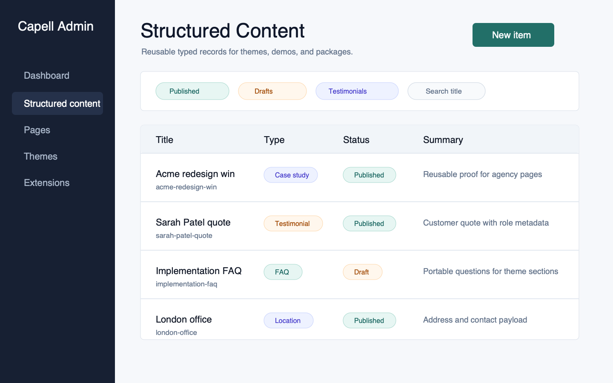
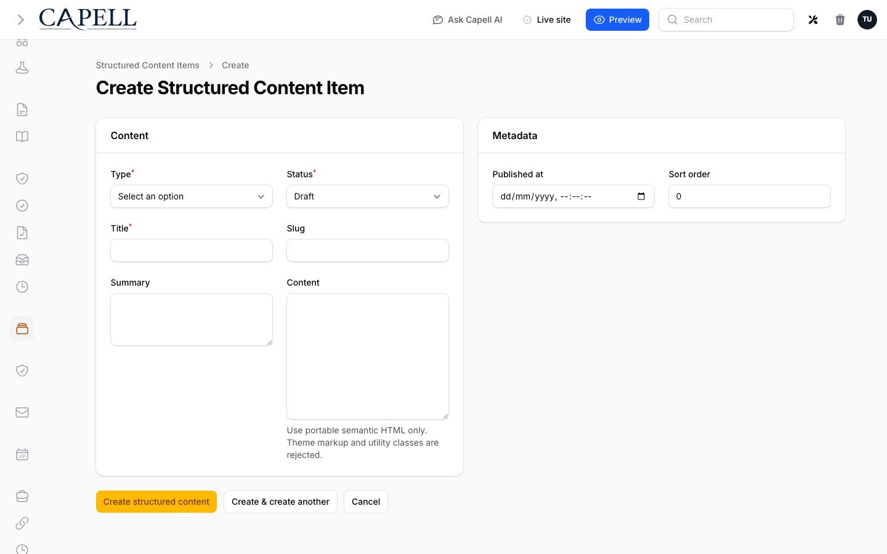

# Structured Content Library

<!-- prettier-ignore-start -->

## What This Plugin Adds

Structured Content Library is an **Available**, **Schema-owning** Capell package in the **Capell Foundation** product group. It ships as `capell-app/structured-content-library` and extends these surfaces: admin, shared.

Structured Content Library stores portable reusable records for case studies, testimonials, team members, services, FAQs, resources, partners, locations, and logos.

After install, admins get package-owned management or reporting surfaces inside Capell.

Status details:

- Status: Available
- Tier: free
- Bundle: foundation
- Composer package: `capell-app/structured-content-library`
- Namespace: `Capell\StructuredContentLibrary`
- Theme key: not applicable

## Why It Matters

**For developers:** The package gives developers package-owned service providers, Actions, Data objects, models, and Filament classes instead of pushing this behaviour into core or application code.

**For teams:** A typed content library for testimonials, case studies, team members, FAQs, services and more - reusable, theme-safe records your themes render anywhere.

## Screens And Workflow

Screenshot contract: `docs/screenshots.json`.

- Structured content item list (admin, required).
- Structured content create form (admin, required).
- Structured content reusable item edit form (admin, required).
- Structured content testimonial public render (frontend, optional).
- Structured content type variation (admin, optional).
- Structured content empty state (admin, optional).

## Technical Shape

- Service providers: `Capell\StructuredContentLibrary\Providers\StructuredContentLibraryServiceProvider`.
- Migrations: `packages/structured-content-library/database/migrations/2026_05_31_000001_create_structured_content_items_table.php`, `packages/structured-content-library/database/migrations/2026_06_04_000001_add_unique_scope_slug_index_to_structured_content_items_table.php`, `packages/structured-content-library/database/migrations/2026_07_10_000001_add_normalized_scope_key_to_structured_content_items.php`.
- Models: `StructuredContentItem`.
- Filament classes: `CreateStructuredContentItem`, `EditStructuredContentItem`, `ListStructuredContentItems`, `StructuredContentItemResource`.
- Policies: `StructuredContentItemPolicy`.
- Actions: `AuthorizeStructuredContentMutationAction`, `BuildPublicStructuredContentItemsAction`, `BuildPublicStructuredContentItemsForTypesAction`, `BuildPublicStructuredContentPayloadAction`, `BuildStructuredContentSectionsAction`, `CreateStructuredContentItemAction`, `EnsurePortableContentHtmlAction`, `ImportStructuredContentItemsAction`, `ListStructuredContentItemsAction`, `ResolveUniqueStructuredContentSlugAction`, `UpdateStructuredContentItemAction`.
- Data objects: `PublicStructuredContentItemData`, `StructuredContentImportResultData`, `StructuredContentItemData`, `StructuredContentPayloadData`, `StructuredContentSectionData`.
- Manifest contributions: `admin-resource: Capell\StructuredContentLibrary\Manifest\StructuredContentItemResourceContribution`, `agent-capability: Capell\StructuredContentLibrary\Manifest\StructuredContentSectionAdapterContribution`, `agent-capability: Capell\StructuredContentLibrary\Manifest\StructuredContentThemeAdapterContribution`, `model: Capell\StructuredContentLibrary\Manifest\StructuredContentModelsContribution`.
- Health checks: `Capell\StructuredContentLibrary\Health\StructuredContentLibraryHealthCheck`.
- Cache tags: `structured-content-library`.

## Data Model

- Required tables: `structured_content_items`.
- Models: `StructuredContentItem`.
- Migration files: `2026_05_31_000001_create_structured_content_items_table.php`, `2026_06_04_000001_add_unique_scope_slug_index_to_structured_content_items_table.php`, `2026_07_10_000001_add_normalized_scope_key_to_structured_content_items.php`.
- Migration impact: run host migrations through the package install flow before opening package surfaces.
- Deletion/retention behaviour: Docs gap unless the package has an explicit pruning command, retention setting, or tested cascade path.

## Install Impact

- Admin navigation: adds package-owned Filament classes when registered.
- Permissions: `ViewAny:StructuredContentItem`, `View:StructuredContentItem`, `Create:StructuredContentItem`, `Update:StructuredContentItem`, `Delete:StructuredContentItem`.
- Public routes: none detected in package route files.
- Database changes: package migrations are declared.
- Settings: no package settings declared.
- Queues or schedules: none detected in standard package paths.
- Cache tags: `structured-content-library`.
- Commands: none declared.

## Common Pitfalls

- Run migrations before opening package resources or public routes.
- Keep `composer.json`, `composer.local.json`, `capell.json`, docs, screenshots, and tests aligned when the package surface changes.

## Troubleshooting

| Symptom | Likely cause | Check | Fix |
| --- | --- | --- | --- |
| Package surface is missing after install | Provider or manifest is not loaded | Confirm `capell.json`, package `composer.json`, and provider registration | Reinstall the package, refresh Composer autoload, and clear host caches |
| Admin screen or command fails on missing table | Package migrations have not run | Check the tables listed in `Data Model` | Run host migrations and rerun the focused package test |

## Quick Start

1. Install the package: `composer require capell-app/structured-content-library`.
2. Run the required setup: `php artisan migrate`.
3. Open the related Capell admin surface and verify Structured Content Library appears.

## Next Steps

- [Package docs](docs/README.md)
- [Overview](docs/overview.md)
- [Screenshot contract](docs/screenshots.json)
- [Marketplace assets](docs/assets/marketplace/)
- [Capell content language plan](../../docs/CONTENT_LANGUAGE_PLAN.md)
- [Capell documentation design system](../../docs/DESIGN_SYSTEM.md)
- [Capell and package ERD notes](../../docs/erd/capell-and-package-erds.md)
- Related packages: [Content Sections](../content-sections/README.md), [Theme Foundation](../theme-foundation/README.md).
- Focused tests: `vendor/bin/pest packages/structured-content-library/tests --configuration=phpunit.xml`.

<!-- prettier-ignore-end -->
