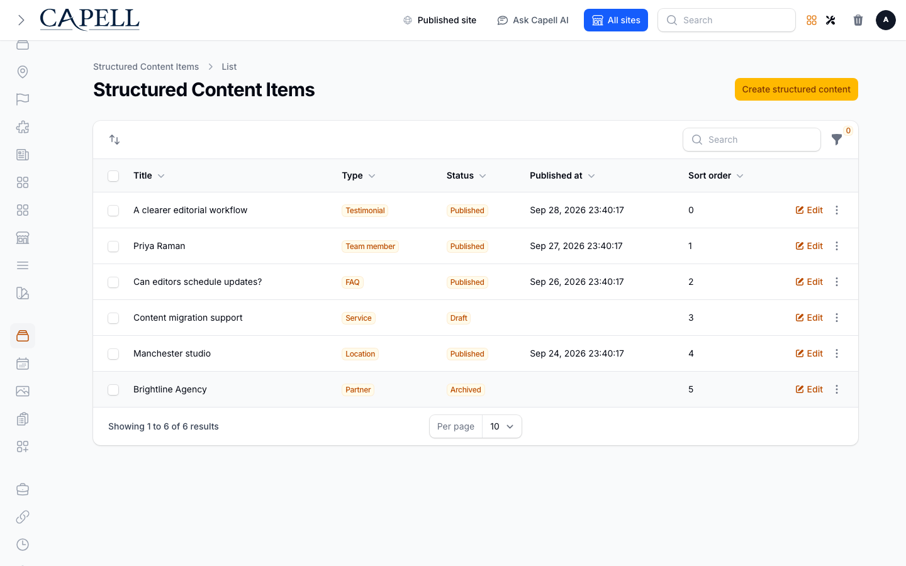
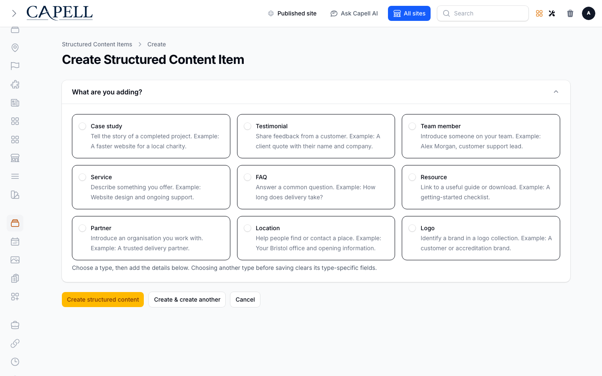

# Structured Content Library

<!-- prettier-ignore-start -->

## What This Plugin Adds

Structured Content Library is an **Available**, **Schema-owning** Capell package in the **Capell Foundation** product group. It ships as `capell-app/structured-content-library` and extends these surfaces: admin, shared.

Structured Content Library stores reusable case studies, testimonials, team members, services, FAQs, resources, partners, locations, and logos as portable records.

Editors maintain structured items in one admin resource. Content Sections and themes receive hydrated public data without querying models from public views.

Status details:

- Status: Available
- Tier: free
- Bundle: foundation
- Composer package: `capell-app/structured-content-library`
- Namespace: `Capell\StructuredContentLibrary`
- Theme key: not applicable

## Why It Matters

**For developers:** Typed data and adapter contributions provide a package boundary for public records, with portable HTML checks and caching handled before rendering.

**For teams:** Teams can maintain one approved record for repeated people, services, proof, or reference content and reuse it across supported packages.

## Screens And Workflow

Screenshot contract: `docs/screenshots.json`.

- Structured content item list (admin, required evidence).
- Structured content create form (admin, required evidence).
- Structured content reusable item edit form (admin, required evidence).
- Structured content testimonial public render (frontend, supplementary evidence).
- Structured content type variation (admin, supplementary evidence).
- Structured content empty state (admin, supplementary evidence).
- Structured content item list with admin sidebar menu open (admin, supplementary evidence).

## Technical Shape

### Service providers

- `Capell\StructuredContentLibrary\Providers\StructuredContentLibraryServiceProvider`

### Migrations

- `packages/structured-content-library/database/migrations/2026_05_31_000001_create_structured_content_items_table.php`
- `packages/structured-content-library/database/migrations/2026_06_04_000001_add_unique_scope_slug_index_to_structured_content_items_table.php`
- `packages/structured-content-library/database/migrations/2026_07_10_000001_add_normalized_scope_key_to_structured_content_items.php`

### Models

- `StructuredContentItem`

### Filament classes

- `CreateStructuredContentItem`
- `EditStructuredContentItem`
- `ListStructuredContentItems`
- `StructuredContentItemResource`

### Policies

- `StructuredContentItemPolicy`

### Actions

- `AuthorizeStructuredContentMutationAction`
- `BuildPublicStructuredContentItemDataAction`
- `BuildPublicStructuredContentItemsAction`
- `BuildPublicStructuredContentItemsForTypesAction`
- `BuildPublicStructuredContentPayloadAction`
- `BuildStructuredContentSectionsAction`
- `CreateStructuredContentItemAction`
- `EnsurePortableContentHtmlAction`
- `ImportStructuredContentItemsAction`
- `ListStructuredContentItemsAction`
- `ResolveUniqueStructuredContentSlugAction`
- `SeedStructuredContentScreenshotFixtureAction`
- `UpdateStructuredContentItemAction`
- `ValidateStructuredContentPayloadAction`

### Data objects

- `PublicStructuredContentItemData`
- `StructuredContentDefinitionData`
- `StructuredContentImportResultData`
- `StructuredContentItemData`
- `StructuredContentPayloadData`
- `StructuredContentSectionData`

### Manifest action API

- `buildPublicStructuredContentItems: Capell\StructuredContentLibrary\Actions\BuildPublicStructuredContentItemsAction`
- `buildStructuredContentSections: Capell\StructuredContentLibrary\Actions\BuildStructuredContentSectionsAction`
- `importStructuredContentItems: Capell\StructuredContentLibrary\Actions\ImportStructuredContentItemsAction`
- `listStructuredContentItems: Capell\StructuredContentLibrary\Actions\ListStructuredContentItemsAction`

### Console command classes

- `SeedStructuredContentScreenshotFixtureCommand`

### Manifest contributions

- `admin-resource: Capell\StructuredContentLibrary\Manifest\StructuredContentItemResourceContribution`
- `agent-capability: Capell\StructuredContentLibrary\Manifest\StructuredContentSectionAdapterContribution`
- `agent-capability: Capell\StructuredContentLibrary\Manifest\StructuredContentThemeAdapterContribution`
- `model: Capell\StructuredContentLibrary\Manifest\StructuredContentModelsContribution`

### Health checks

- `Capell\StructuredContentLibrary\Health\StructuredContentLibraryHealthCheck`

### Blade views

- `packages/structured-content-library/resources/views/admin/preview.blade.php`
- `packages/structured-content-library/resources/views/forms/type-cards.blade.php`

### Cache tags

- `structured-content-library`

## Data Model

- Required tables: `structured_content_items`.
- Models: `StructuredContentItem`.
- Core record references in migrations: `sites via site_id`.
- Migration files: `2026_05_31_000001_create_structured_content_items_table.php`, `2026_06_04_000001_add_unique_scope_slug_index_to_structured_content_items_table.php`, `2026_07_10_000001_add_normalized_scope_key_to_structured_content_items.php`.
- Migration impact: run host migrations through the package install flow before opening package surfaces.
- Deletion/retention behaviour: migrations declare null-on-delete relationships; no timed pruning or retention schedule is declared in `capell.json`.

## Install Impact

- Required packages: `capell-app/admin`, `capell-app/core`.
- Admin navigation: declares `admin-resource: StructuredContentItemResourceContribution`; each Filament page or resource controls its own navigation visibility.
- Admin/editor extensions: none declared.
- Permissions: `ViewAny:StructuredContentItem`, `View:StructuredContentItem`, `Create:StructuredContentItem`, `Update:StructuredContentItem`, `Delete:StructuredContentItem`; access also governed by package policies: `StructuredContentItemPolicy`.
- Public routes: none declared.
- Database changes: package migrations are declared.
- Config: no package config files.
- Settings: no package settings declared.
- Queues or schedules: none declared.
- Cache tags: `structured-content-library`.
- Commands: console command classes detected: `SeedStructuredContentScreenshotFixtureCommand`.

## Common Pitfalls

- Keep required Capell packages on compatible v4 releases: `capell-app/admin`, `capell-app/core`.
- Run migrations before opening package resources or public routes.
- Custom write integrations must preserve invalidation for `structured-content-library` cache tags.

## Troubleshooting

| Symptom | Likely cause | Check | Fix |
| --- | --- | --- | --- |
| Package surface is missing after install | Provider or manifest is not loaded | Confirm `capell.json`, package `composer.json`, and provider registration | Reinstall the package, refresh Composer autoload, and clear host caches |
| Admin screen or command fails on missing table | Package migrations have not run | Check the tables listed in `Data Model` | Run host migrations and rerun the focused package test |

## Quick Start

1. Install the package: `composer require capell-app/structured-content-library`.
2. Open the package admin surface at `/admin/structured-content-library/structured-content-items` and confirm Structured Content Library is available.

## Next Steps

- [Package docs](docs/README.md)
- [Overview](docs/overview.md)
- [Worked extension examples](docs/extension-contracts.md)
- [Troubleshooting](#troubleshooting)
- [Screenshot contract](docs/screenshots.json)
- [Marketplace assets](docs/assets/marketplace/)
- [Capell content language plan](../../docs/CONTENT_LANGUAGE_PLAN.md)
- [Capell documentation design system](../../docs/DESIGN_SYSTEM.md)
- [Capell and package ERD notes](../../docs/erd/capell-and-package-erds.md)
- Related packages: [Content Sections](../content-sections/README.md), [Theme Foundation](../theme-foundation/README.md).

<!-- prettier-ignore-end -->
